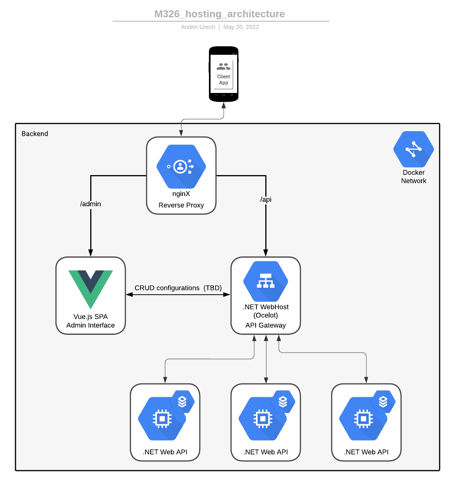

# M326 API Gateway

Welcome to the API Gateway repository.  
This repository provides a documentation overview on the [backend solution architecture](#backend-architecture-overview) as well as a guide on [how to register your Microservice](#adding-a-microservice-api) within the API Gateway.

[[_TOC_]]

---

## Backend architecture overview



All the backend's services as well as the administration interface are hosted in a docker network on a host system (dev env).
(For production, this could be scaled to a Kubernetes cluster in the Cloud).  
This network exposes a single entrypoint (the *nginx* container) to the host (and to the internet in prod), which proxies requests to either the API Gateway or the admin interface.  
API requests are further proxied to the respective Microservice. Providing this single API Gateway allows for abstracting the different APIs viewed from the Client.  
The gateway implementation ([Ocelot](https://ocelot.readthedocs.io/en/latest/introduction/bigpicture.html)) is expandable for Authentication, request aggregation, Kubernetes integration and more.

## Adding an API Microservice

This chapter will take you through registering your new API Microservice to be forwarded to by the API Gateway.  

### 1. Create your Service  

When creating your API, follow following scheme for your routes: `api/{version}/[controller]`. You don't *have to* version your API, but it's a good practice for later modifications and standardizes this syntax throughout all Services, which makes it more easily understandable for other devs.

### 2. Create a Dockerfile for your Service  

You'll already have one if you selected `Configure Docker` when creating the Project. If you have neither done that nor added one besides that, you can use following template Dockerfile (works for .NET Web API projects with .NET 6.0):

```dockerfile
FROM mcr.microsoft.com/dotnet/sdk:6.0 AS build
WORKDIR /src
COPY {projectName}.csproj .
RUN dotnet restore
COPY . .
RUN dotnet publish -c release -o /app

FROM mcr.microsoft.com/dotnet/aspnet:6.0
WORKDIR /app
EXPOSE 80
EXPOSE 443
COPY --from=build /app .
ENTRYPOINT ["dotnet", "{projectName}.dll"]
```

This `Dockerfile` expects to be placed in the .NET project's root.

### 3. Register your service in the API Gateway's configuration file

In the [APIGateway Project](https://gitlab.com/gibz-mobile-app/backend/api-gateway), open `apiGateway/ocelot.json`.

This file configures how and which requests are being rerouted by the gateway. What you need to do in order to register 
your service under a specific route is to add an entry in the `Routes` array.

Here's an example *Route* for the [Meal Information API](https://gitlab.com/gibz-mobile-app/backend/meal-information):

```json
{
  "DownstreamPathTemplate": "/api/{version}/{everything}",
  "DownstreamScheme": "http",
  "DownstreamHostAndPorts": [
    {
      "Host": "meal-information-api",
      "Port": 80
    }
  ],
  "UpstreamPathTemplate": "/api/{version}/meal/{everything}",
  "UpstreamHttpMethod": [ "POST", "PUT", "GET" ]
}
```  

You can use it as a template for you entry, adjusting following values:  

#### DownstreamPathTemplate

This is the URL the API Gateway will use to communicate with your service. It should match your controllers' configuration.  
Values specified in curly brackets, such as *{everything}*, map exactly to their counterpart in the [UpstreamPathTemplate](#UpstreamPathTemplate).

#### DownstreamHostAndPorts[0].Host

Mind that the *host* here must correspond to the name given to the service in the Docker network (when using Kubernetes, a different syntax is applied).  
If you don't know this name yet, give it a generic kebap-case name like in the example.

#### UpstreamPathTemplate

This is the URL that clients will make requests to your service with. Meaning that all requests matching this 
value will be rerouted by the Gateway to your service with the scheme defined in the [DownstreamPathTemplate](#DownstreamPathTemplate).  
You can use dynamic values in curly brackets, such as *{version}* and *{everything}* in the example, which are passed to and can be used in the [DownstreamPathTemplate](#DownstreamPathTemplate).

#### UpstreamHttpMethod

This array holds the allowed HTTP Methods for the captured route. If you wanted to allow `DELETE` or other calls, you'd have to add this value in the array.

### 4. Configure your Service's CD Pipeline

In order to automatize as much of the DevOps process as possible, we're using the Gitlab Pipeline to build our images and store them 
on the projects' container registries.  

To configure this, add following `.gitlab-ci.yml` file into your repository's root:

```yml
stages:
  - build

build-image:
  image: docker:latest
  stage: build
  services:
    - docker:dind
  before_script:
    - docker login -u "$CI_REGISTRY_USER" -p "$CI_REGISTRY_PASSWORD" $CI_REGISTRY
  script:
    - |
      if [[ "$CI_COMMIT_BRANCH" == "$CI_DEFAULT_BRANCH" ]]; then
          tag=""
          echo "Running on default branch '$CI_DEFAULT_BRANCH': tag = 'latest'"
      else
          tag=":$CI_COMMIT_REF_SLUG"
          echo "Running on branch '$CI_COMMIT_BRANCH': tag = $tag"
      fi
    - docker build --pull -t "$CI_REGISTRY_IMAGE${tag}" .
    - docker push "$CI_REGISTRY_IMAGE${tag}"
  rules:
    - if: $CI_COMMIT_BRANCH
      exists:
        - Dockerfile
```

This configuration will build the image as specified in your `Dockerfile` and push it to the repository's container registry.  
The pipeline will trigger on any branch and tag images with their branch name. Only the `main` branch's images will be tagged as `:latest`.  


**If your Dockerfile is _not_ on your repository's root**, you'll have to provide the `docker build` command executed in the `build-image.script` part 
with the right context (e.g. `./your-project-src`) and also adjust the path given in `rules.if.exists`.  

### 5. (Dev/Test environment) Add your Service to the Docker compose deploy unit

[Docker compose](https://docs.docker.com/compose/) allows hosting multiple containers inside a fenced off network. Its simple setup 
makes it perfect for use in dev- / test environments, but it lacks the orchestration power of Kubernetes often required in production.

#### Docker Compose

Add an entry in the *services* section of the `docker-compose.yml` used on the hosting system for your Service following this scheme:

```yml
{name-in-network}:
  image: registry.gitlab.com/gibz-mobile-app/backend/{project}:latest
  depends_on:
    - api-gateway
```

The *name-in-network* must correspond to your service's *host* value in the API Gateway Project's `ocelot.json` file.  
The integral value for *image* can be found on your Project's Docker Registry.

When we start the Docker network with `docker-compose up`, the latest image with your service will now be pulled and put in a container in the same 
network as all the other services, where it can start providing its service via the API Gateway.

### 5. (Prod) Add a Kubernetes Deployment

This section is a **_draft_*.*!

Add a deployment- & service yml configuration. Somewhere along the line of this example:

```yml
---
apiVersion: apps/v1
kind: Deployment
metadata:
  name: weather-forecast-api
spec:
  replicas: 1
  template:
    metadata:
      labels:
        app: weather-forecast-api
    spec:
      containers:
      - name: weather-forecast-api
        image: aurech/weatherforecastapi:latest
        ports:
        - containerPort: 80
  selector:
    matchLabels:
      app: weather-forecast-api
---
apiVersion: v1
kind: Service
metadata:
  name: weather-forecast-api
spec:
  type: ClusterIP
  ports:
  - port: 80
  selector:
    app: weather-forecast-api
```
